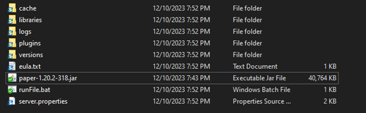
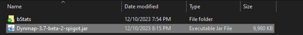
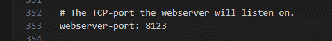
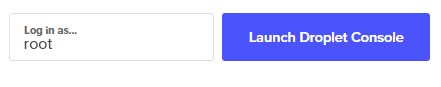

<h1 align = center>Unix-Project</h1>

<h2>How To Run Your Own Minecraft Server</h2>

<h4 align = center>(The installation was done on windows; steps will vary if done on Linux)</h4>

Firstly, we need to create a server. We would need to download the Papermc software. It is a modified version of the basic Minecraft server software that gives us the functionality to run plugins and have a lot more control over the server.

<a href = "https://papermc.io/downloads/paper">PaperMc downloads for paper</a>    

After downloading, create a batch file with the following command: "java -Xmx1024M -Xms1024M -jar minecraft_server.1.20.4.jar nogui"

<b>Important: Replace “1024M” by the amount of ram that you want to allocate for the server. 2048M is strongly recommended but more will be needed for bigger servers. Also replace “Minecraft_server.1.20.4.jar” by the name of the server.</b>

After running the .Bat file, you will see these files created. You will need to accept the EULA to proceed. Simply change the value from “false” to “true” in “eula.txt”

Rerun your .Bat file and you should see the rest of the files.   
  Your server should be running now, and you can change the server port or other settings in server.properties.   
  Unfortunately, only people connected to your Wi-Fi can see the server, so you will need to open a port (check your router settings). After opening a port, you can give your IP and port number to allow other people to connect to your server (if you want to give your server IP to people you don’t trust, get a server hostname so they won’t know your IP).  

<h2>Setup Dynmap:</h2>

Now that we have a running server with PaperMC, we can install Dynmap (Dynamic Map) on our server. It will be used to track the map on our minecraft server. You will first need to download Dynmap on their website.

<a href = "https://www.spigotmc.org/resources/dynmap%C2%AE.274/">Dynmap download</a>    

You will have a .jar file downloaded. You will need to drag that file in your “plugins” folder.

Restart your server and you should see a Dynmap folder appear. Open that folder and open configuration.txt. On line 353, change your webserver port to the wanted port. Restart your server again and you should see the map if you enter your Ip + port on a web browser (eg: 192.168.16.125:22527).  If you want external users or the website to see your page, you will also need to open this port.

<h2>Setting up a webserver:</h2>

If you want to set up a webserver that will always be running to display things like commands and a map of Dynmap you can use a VPS. In this case the virtual private server we went with is called Digital Ocean, which at the time that this readme was created looks like:

Once you have successfully created your droplet (we went for a 6 dollar a month droplet running Debian 12), you would need to launch the droplet console to install an websever which in this case we went with apache2

Once you click this you will be presented with your droplet’s console. In your console, it is recommended to first do apt update and then do apt upgrade to get the latest packages for your droplet, then to install the webserver, you would do sudo apt install apache2. You can then test if your webserver works by going to the Ip of your droplet, which is shown in digital ocean. You should be presented with the default Apache page saying that it works. To change the page to look like the GitHub repository we made, you would first navigate to /var/www/html, then git clone our link on the droplet, and refresh. If your server does not have git installed by default which you can check by doing git -v, you would need to do sudo apt install git

<h2>Why is my dynmap blank?</h2>

This is probably because the dynmap’s ip on the website is set to the wrong link, all you would need to do is change the website dynmap’s Ip to your own e.g. a href="put your link to dynmap here" or <iframe src=”replace ip here” width='100%' height='600'></iframe>

<h2>Syncing the local console to the webserver</h2>

By default, the logs provided will probably be just tests of a example of how your logs will look.

To change that, you first would need to locate your Minecraft server’s log. It is usually named latest.log. Once you find the log that contains information about what is currently going on in the server, you would need to create a .bat file on your windows machine with the code: 

 
@echo off  
:loop  
echo Performing SCP command  
scp "link to your log here" servername(root is default)@(server’s ip):\var\www\html  
timeout /t 10 /nobreak > nul  
goto loop  

 by default, it is set to run every 10 seconds, to change that, change the number in /t     You would also need to add your rsa key to the server so it wouldn’t ask you for the password every sync. 
